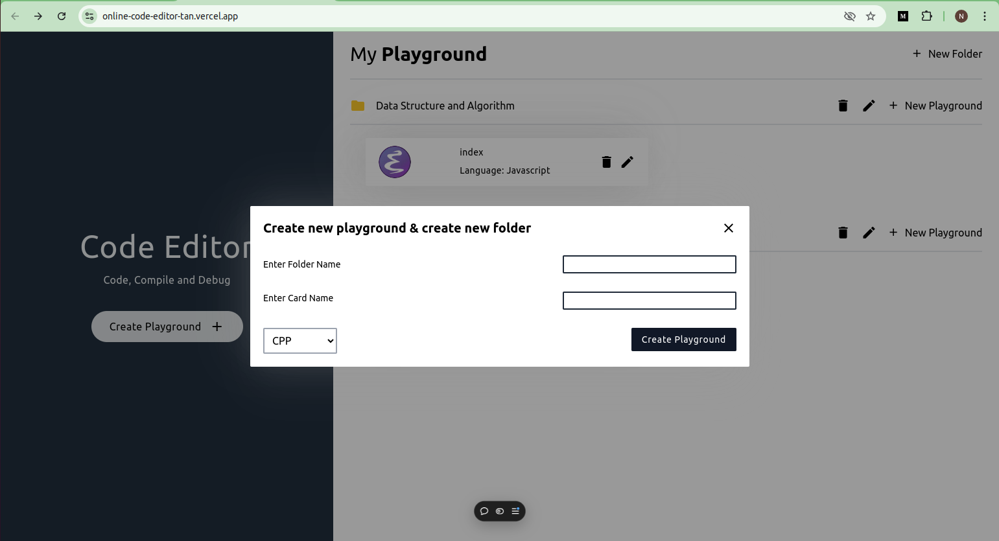

# Code Editor Project

A powerful web-based code editor that allows users to manage files, write and edit code with syntax highlighting, and export or import code. The editor comes with customizable themes, multiple language support, and a full-screen mode for an enhanced coding experience.

## Features

- **File Management:** Create, edit, and delete folders and files (playgrounds) in the application.
- **Code Editor:** Syntax highlighting for multiple programming languages.
- **Theme Switching:** Change between different editor themes to suit your preferences.
- **Language Support:** Switch between different programming languages.
- **Full-Screen Mode:** A distraction-free full-screen coding environment.
- **Import/Export Code:** Import code from local files and export your code to your system.

## Installation

To get started with the project, follow these steps:

1. Clone the repository:

   ```bash
   git clone https://github.com/nachatra-sharma/online-code-editor
   ```

2. Navigate to the project directory:

   ```bash
   cd online-code-editor
   ```

3. Install the dependencies:

   ```bash
   npm install
   ```

4. start the application

   ```bash
   npm run dev
   ```

- The application should now be running at http://localhost:PORT/

## Usage

- **Create a folder:** Click the "Create Folder" button to create a new folder.
- **Create a playground:** Inside a folder, you can create files (playgrounds) to write your code.
- **Syntax highlighting:** Open a file, select the language from the dropdown, and start coding!
- **Switch themes:** Toggle between light and dark modes (or other themes) using the settings panel.
- **Full-Screen Mode:** Click the full-screen button to focus entirely on your code.
- **Import/Export:** Use the import/export options to handle code between your local system and the editor.

## Technologies Used

- **Frontend:**
  1. HTML
  2. TailwindCSS
  3. JavaScript (ES6+)
  4. React

## Project Images

### Home page


### Create Playground Button



### Create New Folder


### Edit Folder


### Create New Playground


### Edit File


### Code Editor Page (Dark Theme)


### Code Editor Page (Light Theme)


